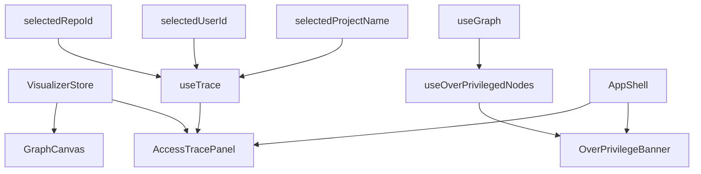

# Access Trace Panel Plan

## Current State

The core frontend graph shell is already in place, so this task is primarily an integration pass rather than a greenfield UI build.

Relevant existing files:

- [apps/frontend/src/components/Layout/AppShell.tsx](apps/frontend/src/components/Layout/AppShell.tsx): currently renders `Sidebar`, `FilterBar`, `GraphCanvas`, and an `AccessTracePlaceholder` pane.
- [apps/frontend/src/components/Layout/AccessTracePlaceholder.tsx](apps/frontend/src/components/Layout/AccessTracePlaceholder.tsx): static placeholder only.
- [apps/frontend/src/components/GraphCanvas/GraphCanvas.tsx](apps/frontend/src/components/GraphCanvas/GraphCanvas.tsx): already loads the graph, filters `isOverPrivileged` nodes, and handles node selection.
- [apps/frontend/src/api/insightops.api.ts](apps/frontend/src/api/insightops.api.ts): already exposes `useTrace(projectName, userId, repoId)` plus `useUsers()` and `useRepos()`.
- [apps/frontend/src/stores/visualizer.store.ts](apps/frontend/src/stores/visualizer.store.ts): already holds `selectedUserId`, `selectedRepoId`, and `clearSelection()`.
- [apps/frontend/src/utils/graphIds.ts](apps/frontend/src/utils/graphIds.ts): already normalizes repo node ids vs raw repo ids.

The biggest functional mismatch today is selection behavior:

- [apps/frontend/src/components/GraphCanvas/GraphCanvas.tsx](apps/frontend/src/components/GraphCanvas/GraphCanvas.tsx) currently clears the repo when a user is clicked, and clears the user when a repo is clicked.
- [apps/frontend/src/stores/visualizer.store.ts](apps/frontend/src/stores/visualizer.store.ts) currently makes `clearSelection()` clear the selected project too, which would be the wrong behavior for a trace panel close button or Escape shortcut.

## Target Outcome

Add a persistent right-side trace pane that:

- shows a placeholder when nothing is selected
- shows a loading skeleton while `useTrace()` is fetching
- shows a full access timeline, permissions, and no-access states once both a user and repo are selected
- supports clearing the active trace selection without dropping the selected project

Also add a global over-privilege summary banner that works with the existing node-level `isOverPrivileged` styling already present in the graph UI.

## Architecture Snapshot

## Implementation Phases

### 1. Build the trace panel component set

Create the trace UI under a dedicated Access Trace area:

- [apps/frontend/src/components/AccessTrace/AccessTracePanel.tsx](apps/frontend/src/components/AccessTrace/AccessTracePanel.tsx)
- [apps/frontend/src/components/AccessTrace/TraceStep.tsx](apps/frontend/src/components/AccessTrace/TraceStep.tsx)
- [apps/frontend/src/components/AccessTrace/PermissionChip.tsx](apps/frontend/src/components/AccessTrace/PermissionChip.tsx)

The panel should read from [apps/frontend/src/stores/visualizer.store.ts](apps/frontend/src/stores/visualizer.store.ts) and reuse [apps/frontend/src/api/insightops.api.ts](apps/frontend/src/api/insightops.api.ts):

- `useTrace(selectedProjectName, selectedUserId, selectedRepoId)` for the trace payload
- `useUsers(selectedProjectName)` and `useRepos(selectedProjectName)` to resolve the selected user’s display name/email and selected repo name/default branch for the header

This phase should include four visual states:

- no selection placeholder
- loading skeleton
- success with timeline + chips
- explicit no-access banner when `trace.hasAccess === false`

Because `AccessTrace` does not contain full user email or repo label metadata, the plan assumes the panel will derive those from the already-existing users/repos query hooks rather than adding new backend endpoints.

### 2. Add permission and timeline presentation primitives

`TraceStep.tsx` and `PermissionChip.tsx` should be the reusable presentation layer for the trace panel.

Planned responsibilities:

- map `PermissionLevel` to timeline-dot color, chip styling, and tooltip copy
- render `viaGroup` only when present
- keep timeline structure stable even for empty or deny-heavy traces
- use small, memo-friendly presentational components rather than mixing all logic into the main panel component

A native `title` tooltip or a small inline hover description is sufficient; no new tooltip library is needed.

### 3. Add over-privilege summary logic and banner

Create:

- [apps/frontend/src/hooks/useOverPrivilegedNodes.ts](apps/frontend/src/hooks/useOverPrivilegedNodes.ts)
- [apps/frontend/src/components/OverPrivilege/OverPrivilegeBanner.tsx](apps/frontend/src/components/OverPrivilege/OverPrivilegeBanner.tsx)

The hook should:

- accept `AccessGraph | undefined`
- split flagged nodes into users vs groups
- produce the requested summary string

The banner should sit below the filter bar and above the graph canvas in [apps/frontend/src/components/Layout/AppShell.tsx](apps/frontend/src/components/Layout/AppShell.tsx), and it should:

- show whenever `showOnlyOverPrivileged` is enabled or flagged entities exist
- summarize flagged user/group counts
- expand to list the flagged entities

Important contract detail:

- the current backend graph builder only guarantees `isOverPrivileged: boolean`
- if the banner needs to show “specific elevated bits”, it should attempt to read them from `GraphNode.metadata` fields such as `explicitAllowNames` when present, with a graceful fallback to a generic “elevated permissions detected” label when metadata is missing or not shaped as expected

For the requested verification with mock data, the plan assumes a small development-only fallback can be used if the live graph does not currently contain flagged nodes. That fallback should remain isolated to development behavior rather than shipping hardcoded production banner content.

### 4. Fix the selection flow so tracing is actually possible

This is the most important behavioral phase.

To support “select a user and a repository” with the existing app structure, make the minimal shared-state updates in:

- [apps/frontend/src/stores/visualizer.store.ts](apps/frontend/src/stores/visualizer.store.ts)
- [apps/frontend/src/components/GraphCanvas/GraphCanvas.tsx](apps/frontend/src/components/GraphCanvas/GraphCanvas.tsx)

Planned changes:

- refine `clearSelection()` so it clears only the active trace selection and hover state, while preserving the currently selected project and general UI filters/layout
- update graph node click behavior so selecting a user no longer clears the selected repo, and selecting a repo no longer clears the selected user
- support clicking an already-selected node to clear just that side of the selection
- keep using [apps/frontend/src/utils/graphIds.ts](apps/frontend/src/utils/graphIds.ts) for repo-id normalization

This preserves the user’s requested `store.clearSelection()` API while making its semantics match the desired trace-panel UX.

### 5. Wire the new UI into the existing shell

Update [apps/frontend/src/components/Layout/AppShell.tsx](apps/frontend/src/components/Layout/AppShell.tsx) to:

- replace the placeholder pane with `AccessTracePanel`
- insert `OverPrivilegeBanner` between `FilterBar` and `GraphCanvas`
- keep the trace pane always visible
- animate width changes between placeholder and populated states using Tailwind transitions

The old [apps/frontend/src/components/Layout/AccessTracePlaceholder.tsx](apps/frontend/src/components/Layout/AccessTracePlaceholder.tsx) can then be retired or left unused, depending on what keeps the change smallest and clearest.

## Validation Plan

After implementation, verify the requested behavior through:

1. `cd apps/frontend && bun run typecheck`
2. `cd apps/frontend && bun run dev`
3. confirm the right pane renders the placeholder when no user/repo pair is selected
4. confirm the pane renders a skeleton while `useTrace()` is loading
5. confirm the no-access banner appears when `trace.hasAccess === false`
6. confirm the over-privilege banner is visible using either real flagged graph data or a tightly scoped development-only fallback
7. commit with `feat(frontend): implement access trace panel and over-privilege detection`

## Key Risks To Preserve

- The current mutual-exclusion selection model in [apps/frontend/src/components/GraphCanvas/GraphCanvas.tsx](apps/frontend/src/components/GraphCanvas/GraphCanvas.tsx) prevents `useTrace()` from ever enabling until it is adjusted.
- The current `clearSelection()` implementation in [apps/frontend/src/stores/visualizer.store.ts](apps/frontend/src/stores/visualizer.store.ts) clears the selected project, which would be a UX regression for Escape / close-panel handling unless corrected.
- `AccessTrace` does not currently include repo display name or user email, so the panel header must resolve those from cached `useUsers()` and `useRepos()` data.
- The banner’s “specific elevated bits” requirement depends on optional `GraphNode.metadata` contents from the backend graph; the frontend should degrade gracefully when that metadata is incomplete.
- Existing node-level over-privilege styling already exists in the graph UI, so this task should extend and summarize that behavior rather than duplicating or replacing it wholesale.
