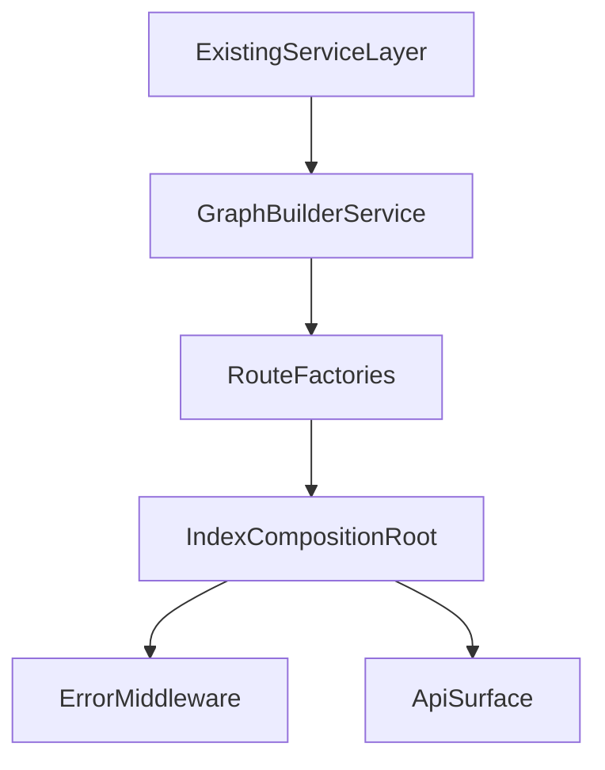

# Backend Graph Routes Subagent Plan

## Current State

The backend is no longer a blank scaffold, so the next subagent should integrate with existing services rather than assume the original brief's method names.

Existing foundation and service layer:

- [apps/backend/src/clients/azureDevOps.client.ts](apps/backend/src/clients/azureDevOps.client.ts)
- [apps/backend/src/config/env.ts](apps/backend/src/config/env.ts)
- [apps/backend/src/constants/azdo.constants.ts](apps/backend/src/constants/azdo.constants.ts)
- [apps/backend/src/types/azdo.types.ts](apps/backend/src/types/azdo.types.ts)
- [apps/backend/src/types/graph.types.ts](apps/backend/src/types/graph.types.ts)
- [apps/backend/src/services/graph.service.ts](apps/backend/src/services/graph.service.ts)
- [apps/backend/src/services/security.service.ts](apps/backend/src/services/security.service.ts)
- [apps/backend/src/services/git.service.ts](apps/backend/src/services/git.service.ts)
- [apps/backend/src/services/identity.service.ts](apps/backend/src/services/identity.service.ts)

Current integration gaps:

- [apps/backend/src/services/graphBuilder.service.ts](apps/backend/src/services/graphBuilder.service.ts) does not exist yet.
- [apps/backend/src/routes](apps/backend/src/routes) has no real route modules yet.
- [apps/backend/src/middleware/errorHandler.ts](apps/backend/src/middleware/errorHandler.ts) does not exist yet.
- [apps/backend/src/index.ts](apps/backend/src/index.ts) still mounts `501 Not Implemented` placeholders for `/api/projects`, `/api/users`, `/api/repos`, `/api/graph`, and `/api/trace`.

## Why A New Subagent

A second project-level subagent is preferable to widening [`.cursor/agents/backend-services-implementer.md`](.cursor/agents/backend-services-implementer.md).

Reason:

- the existing subagent is focused on low-level Azure DevOps data services under [apps/backend/src/services](apps/backend/src/services)
- this new task is an orchestration layer concern: graph aggregation, route factories, dependency injection, and HTTP error translation
- keeping these as separate subagents follows the attached subagent-skill guidance to design focused, reusable agents

## Target Outcome

Create a new project-level subagent at [`.cursor/agents/backend-graph-routes-implementer.md`](.cursor/agents/backend-graph-routes-implementer.md).

Its job will be to:

- implement [apps/backend/src/services/graphBuilder.service.ts](apps/backend/src/services/graphBuilder.service.ts)
- create route factories under [apps/backend/src/routes](apps/backend/src/routes)
- add [apps/backend/src/middleware/errorHandler.ts](apps/backend/src/middleware/errorHandler.ts)
- replace the placeholder route wiring in [apps/backend/src/index.ts](apps/backend/src/index.ts)
- make only minimal compatibility edits to the existing service files if TypeScript or missing integration points require them

## Architecture Snapshot

## Existing Service APIs To Design Around

The new subagent prompt should explicitly call out the real current method surfaces so it does not code against the earlier abstract brief.

Current service signatures to account for:

- [apps/backend/src/services/graph.service.ts](apps/backend/src/services/graph.service.ts)
  - `listProjects()`
  - `listAllGroups()`
  - `listAllUsers()`
  - `fetchMembershipsUp(subjectDescriptor)`
  - `getCachedMembershipMap(subjectDescriptors)`
  - `expandTransitiveContainers(seedDescriptors, maxDepth?)`
- [apps/backend/src/services/git.service.ts](apps/backend/src/services/git.service.ts)
  - `listRepositories(project)`
- [apps/backend/src/services/security.service.ts](apps/backend/src/services/security.service.ts)
  - `listNamespaces()`
  - `getGitNamespace()`
  - `getAccessControlLists({ namespaceId, token, recurse })`
  - `getProjectGitAcls(projectId)`
  - `decodeAce(ace, actions)`
- [apps/backend/src/services/identity.service.ts](apps/backend/src/services/identity.service.ts)
  - `resolveDescriptors(descriptors)`
  - `buildMaps(identities)`
  - `resolveAndBuildMaps(descriptors)`

This is the most important planning constraint: the next subagent should adapt the graph builder and routes to these APIs first, and only patch the lower-level services where there is a clear gap.

## Subagent File Design

Recommended frontmatter for [`.cursor/agents/backend-graph-routes-implementer.md`](.cursor/agents/backend-graph-routes-implementer.md):

- `name`: `backend-graph-routes-implementer`
- `description`: InsightOps backend graph builder and Express route specialist. Use proactively when implementing `graphBuilder.service.ts`, backend route modules, startup wiring in `index.ts`, or API error middleware that composes the existing Graph, Security, Git, and Identity services.

The markdown body should become a repo-specific system prompt that:

- tells the subagent exactly which existing files to read first
- constrains its write scope to the graph builder, route files, error middleware, `index.ts`, and only minimal targeted changes elsewhere if required
- encodes the graph-building and trace-building algorithms from your brief
- requires verification and the requested backend commit message

## Prompt Content To Encode

The new subagent prompt should instruct the future agent to read these files before editing:

- [apps/backend/src/services/graph.service.ts](apps/backend/src/services/graph.service.ts)
- [apps/backend/src/services/security.service.ts](apps/backend/src/services/security.service.ts)
- [apps/backend/src/services/git.service.ts](apps/backend/src/services/git.service.ts)
- [apps/backend/src/services/identity.service.ts](apps/backend/src/services/identity.service.ts)
- [apps/backend/src/clients/azureDevOps.client.ts](apps/backend/src/clients/azureDevOps.client.ts)
- [apps/backend/src/constants/azdo.constants.ts](apps/backend/src/constants/azdo.constants.ts)
- [apps/backend/src/types/azdo.types.ts](apps/backend/src/types/azdo.types.ts)
- [apps/backend/src/types/graph.types.ts](apps/backend/src/types/graph.types.ts)
- [apps/backend/src/middleware/cache.ts](apps/backend/src/middleware/cache.ts)
- [apps/backend/src/index.ts](apps/backend/src/index.ts)

The prompt should also encode these scope boundaries:

- create [apps/backend/src/services/graphBuilder.service.ts](apps/backend/src/services/graphBuilder.service.ts)
- create route files under [apps/backend/src/routes](apps/backend/src/routes)
- create [apps/backend/src/middleware/errorHandler.ts](apps/backend/src/middleware/errorHandler.ts)
- update [apps/backend/src/index.ts](apps/backend/src/index.ts)
- do not touch frontend files
- avoid broad rewrites of the four existing data services; only make small compatibility fixes if the requested graph builder and route flow cannot be implemented cleanly otherwise

## Implementation Workflow The Prompt Should Capture

### 1. Build the aggregation service

Create [apps/backend/src/services/graphBuilder.service.ts](apps/backend/src/services/graphBuilder.service.ts) with injected dependencies:

- `graphService`
- `securityService`
- `gitService`
- `identityService`
- `org`

The subagent prompt should preserve your two target methods:

- `buildAccessGraph(project)`
- `traceAccess(project, userId, repoId)`

But it should also explicitly tell the subagent to map those algorithms onto the existing service API names rather than forcing a rewrite just to match parameter signatures.

### 2. Handle the descriptor and membership mismatches safely

The prompt should call out two current mismatches that the implementation must resolve:

- the current [apps/backend/src/services/graph.service.ts](apps/backend/src/services/graph.service.ts) is oriented around membership lookups using `direction=up` and cached subject-to-container maps, while your access-graph algorithm also needs a group-membership edge construction pass
- the current [apps/backend/src/services/identity.service.ts](apps/backend/src/services/identity.service.ts) builds Graph-to-legacy descriptor maps for identity resolution, but the graph builder still needs a user/group entity lookup keyed by both `subjectDescriptor` and legacy `descriptor`

The prompt should therefore allow one of these implementation patterns:

- derive the missing reverse lookup structures inside [apps/backend/src/services/graphBuilder.service.ts](apps/backend/src/services/graphBuilder.service.ts)
- or add the minimal helper methods needed to [apps/backend/src/services/graph.service.ts](apps/backend/src/services/graph.service.ts) and/or [apps/backend/src/services/identity.service.ts](apps/backend/src/services/identity.service.ts) if that yields a cleaner typed implementation

### 3. Add the route layer

Create these route files as route-factory modules that accept service instances:

- [apps/backend/src/routes/projects.routes.ts](apps/backend/src/routes/projects.routes.ts)
- [apps/backend/src/routes/users.routes.ts](apps/backend/src/routes/users.routes.ts)
- [apps/backend/src/routes/repos.routes.ts](apps/backend/src/routes/repos.routes.ts)
- [apps/backend/src/routes/graph.routes.ts](apps/backend/src/routes/graph.routes.ts)
- [apps/backend/src/routes/trace.routes.ts](apps/backend/src/routes/trace.routes.ts)

The prompt should require Zod validation of query params at the route boundary and transformed response shapes where your brief asks for simplified user/repo payloads.

### 4. Add proper API error handling

Create [apps/backend/src/middleware/errorHandler.ts](apps/backend/src/middleware/errorHandler.ts) and move the ad hoc inline error handling out of [apps/backend/src/index.ts](apps/backend/src/index.ts).

The prompt should require:

- `ZodError -> 400`
- `AzdoApiError 401/403 -> 401`
- `AzdoApiError 429 -> 429` with `Retry-After: 5`
- `AzdoApiError 404 -> 404`
- default `500`
- stack traces only in development
- sanitized generic errors in production

Because no typed API error abstraction exists yet, the prompt should also allow the subagent to introduce a small backend error type if needed to make this middleware work cleanly.

### 5. Wire everything in `index.ts`

Update [apps/backend/src/index.ts](apps/backend/src/index.ts) so startup becomes the composition root:

- construct `AzureDevOpsClient`
- construct the needed caches with `createCache(...)`
- construct `GitService`, `GraphService`, `SecurityService`, `IdentityService`, and `GraphBuilderService`
- mount `/api/health` plus the five real route modules
- mount the shared error handler last

## Verification The Prompt Should Require

The subagent prompt should end with the exact verification workflow:

1. `cd apps/backend && bun run typecheck`
2. `cd apps/backend && bun run dev`
3. confirm `GET /api/health`
4. confirm `GET /api/projects`
5. commit with `feat(backend): implement graph builder and all API routes`

## Key Risks To Preserve In The Plan

- The graph-builder brief uses service names like `listGroups(org)` and `getAcls(org, ...)`, but the current codebase uses instance-bound services where `org` is already injected and method names differ. The subagent prompt must acknowledge this explicitly.
- [apps/backend/src/services/security.service.ts](apps/backend/src/services/security.service.ts) currently returns `undefined` from `getGitNamespace()` rather than throwing, so the graph builder or a service patch must handle the missing-namespace case clearly.
- [apps/backend/src/index.ts](apps/backend/src/index.ts) currently boots using only the validated env config; runtime verification of `/api/projects` still depends on a valid local PAT in [apps/backend/.env](apps/backend/.env).
- `traceAccess` will need deny-overrides-allow logic across both direct and transitive memberships, which is more complex than the current lower-level services expose directly.
- The new subagent should remain narrowly focused on backend graph aggregation and routes, not expand into frontend work or broad service rewrites.
