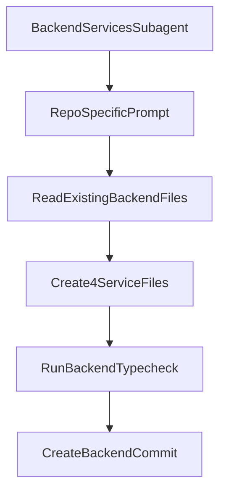

# Backend Services Subagent Plan

## Current State

The repo already has the backend foundation the future subagent must build on:

- [apps/backend/src/clients/azureDevOps.client.ts](apps/backend/src/clients/azureDevOps.client.ts): full-URL Azure DevOps client with `get`, `post`, `paginate`, base URL getters, and 429 retry handling.
- [apps/backend/src/config/env.ts](apps/backend/src/config/env.ts): validated `config` export with `CACHE_TTL_GROUPS`, `CACHE_TTL_USERS`, and `CACHE_TTL_ACLS`.
- [apps/backend/src/constants/azdo.constants.ts](apps/backend/src/constants/azdo.constants.ts): API version constants, namespace IDs, permission bitmasks, and ACL token helpers.
- [apps/backend/src/types/azdo.types.ts](apps/backend/src/types/azdo.types.ts): Zod schemas + inferred types for projects, groups, users, memberships, repositories, ACEs, ACLs, and namespaces.
- [apps/backend/src/middleware/cache.ts](apps/backend/src/middleware/cache.ts): generic TTL cache interface and `createCache()` helper.
- [apps/backend/src/services/.gitkeep](apps/backend/src/services/.gitkeep): the services folder is empty, so the subagent should create the four service files rather than refactor existing services.

## Scope Decision

Create a project-level subagent at [`.cursor/agents/backend-services-implementer.md`](.cursor/agents/backend-services-implementer.md).

This should be project-level rather than user-level because the prompt is tightly coupled to this repo’s existing backend foundation, path aliases, Azure DevOps constants, and service-file boundaries.

## Architecture Snapshot

## Subagent File Design

The subagent file should follow the Cursor subagent format from the attached skill:

- YAML frontmatter with a lowercase hyphenated `name`
- A highly specific `description` that says when to delegate to it and includes proactive wording
- A markdown body that becomes the system prompt

Recommended structure for [`.cursor/agents/backend-services-implementer.md`](.cursor/agents/backend-services-implementer.md):

- `name`: `backend-services-implementer`
- `description`: backend Azure DevOps service specialist for InsightOps. Use proactively when implementing or updating files in `apps/backend/src/services` that depend on the existing client, constants, cache, and Zod schemas.
- body: your provided implementation brief, adjusted to reference the existing foundation files the subagent must read first.

## Prompt Content To Encode

The subagent body should explicitly instruct the future agent to:

- read [apps/backend/src/clients/azureDevOps.client.ts](apps/backend/src/clients/azureDevOps.client.ts), [apps/backend/src/config/env.ts](apps/backend/src/config/env.ts), [apps/backend/src/constants/azdo.constants.ts](apps/backend/src/constants/azdo.constants.ts), [apps/backend/src/types/azdo.types.ts](apps/backend/src/types/azdo.types.ts), and [apps/backend/src/middleware/cache.ts](apps/backend/src/middleware/cache.ts) before editing anything
- create only these service files under [apps/backend/src/services](apps/backend/src/services)
  - [apps/backend/src/services/graph.service.ts](apps/backend/src/services/graph.service.ts)
  - [apps/backend/src/services/security.service.ts](apps/backend/src/services/security.service.ts)
  - [apps/backend/src/services/git.service.ts](apps/backend/src/services/git.service.ts)
  - [apps/backend/src/services/identity.service.ts](apps/backend/src/services/identity.service.ts)
- avoid touching routes and frontend files
- parse every Azure DevOps response with the existing Zod schemas from [apps/backend/src/types/azdo.types.ts](apps/backend/src/types/azdo.types.ts)
- use the injected `AzureDevOpsClient` and injected cache interfaces rather than creating raw HTTP calls
- rely on `client.getBaseUrl()` and `client.getGraphUrl()` because the existing client expects full URLs per request
- preserve the requested verification workflow: `cd apps/backend && bun run typecheck`, fix all TypeScript errors, then commit with `feat(backend): implement graph, security, git, identity services`

## Service Implementation Workflow The Subagent Should Follow

### 1. `graph.service.ts`

Encode the requested responsibilities for:

- cached project listing
- cached group and user pagination through the graph host
- non-cached membership fetches
- cached membership-map construction with 100ms sequential delay
- BFS transitive group resolution with visited-set protection and depth cap 10

### 2. `security.service.ts`

Encode the requested responsibilities for:

- cached namespace discovery
- Git namespace lookup using `GIT_NAMESPACE_ID`
- cached ACL retrieval with `includeExtendedInfo=true`
- permission decoding from namespace actions
- explicit vs effective permission calculation
- over-privilege checks using `OVER_PRIVILEGED_BITS`

### 3. `git.service.ts`

Encode the single repository-listing method using the main base URL, Zod parsing, and a 300-second cache.

### 4. `identity.service.ts`

Encode the descriptor-resolution batching workflow and bidirectional descriptor map construction, plus the combined user/group descriptor index keyed by both `subjectDescriptor` and `descriptor`.

## Repo-Specific Constraints To Preserve In The Prompt

- Keep all Azure DevOps HTTP traffic inside [apps/backend/src/clients/azureDevOps.client.ts](apps/backend/src/clients/azureDevOps.client.ts) by calling its existing methods only.
- Preserve strict TypeScript and Zod-boundary validation rules from the current backend setup.
- Respect the cache contract in [apps/backend/src/middleware/cache.ts](apps/backend/src/middleware/cache.ts), where TTL is determined by the injected cache instance rather than per-call mutation.
- Do not recreate the foundation files that already exist.
- Keep the implementation confined to the four service files unless a later user request expands scope.

## Validation Plan For The Subagent Itself

After creating the subagent file, the next execution step should be to invoke it against the current repo and confirm that it:

1. reads the existing backend foundation first
2. writes only the four service files in [apps/backend/src/services](apps/backend/src/services)
3. runs backend typecheck before finishing
4. uses the requested conventional commit message

## Risks To Carry Forward

- The current backend foundation exposes cache TTLs only via `config` and `createCache()` construction, so the prompt should avoid implying per-method TTL mutation inside service methods.
- Your `resolveDescriptors()` brief specifies `body: { descriptors: batchArray.join(',') }`, while earlier repo documentation describes array-shaped descriptor payloads. The subagent prompt should preserve your explicit requirement, but this is the one area most likely to need runtime verification during implementation.
