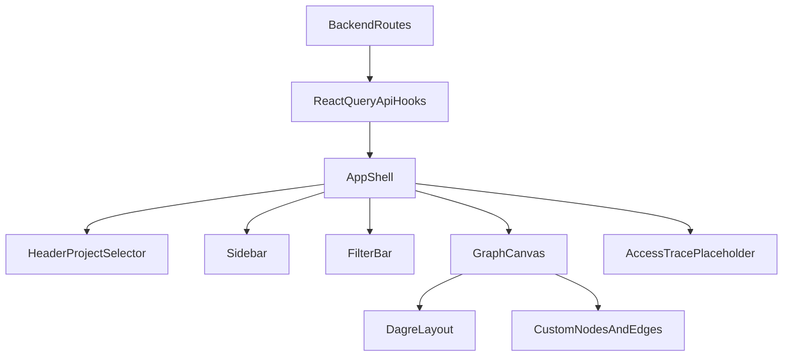

# Frontend Graph Visualization Subagent Plan

## Current State

The frontend is still a lightweight shell, while the backend APIs and graph builder are now live.

Existing frontend foundation:

- [apps/frontend/src/App.tsx](apps/frontend/src/App.tsx): placeholder dark screen with `InsightOps` header and loading copy only.
- [apps/frontend/src/main.tsx](apps/frontend/src/main.tsx): `QueryClientProvider`, `StrictMode`, global dark mode, and stylesheet bootstrapping.
- [apps/frontend/src/stores/visualizer.store.ts](apps/frontend/src/stores/visualizer.store.ts): selection/filter/layout Zustand state already exists and should be reused.
- [apps/frontend/src/types/graph.types.ts](apps/frontend/src/types/graph.types.ts): shared graph and trace contracts already mirror the backend.
- [apps/frontend/src/api](apps/frontend/src/api), [apps/frontend/src/components](apps/frontend/src/components), and [apps/frontend/src/utils](apps/frontend/src/utils): still empty placeholders.

Existing backend contracts the frontend must actually integrate with:

- [apps/backend/src/routes/projects.routes.ts](apps/backend/src/routes/projects.routes.ts): returns `{ projects: [...] }`, not a bare array.
- [apps/backend/src/routes/users.routes.ts](apps/backend/src/routes/users.routes.ts): returns `{ project, users: [...] }`.
- [apps/backend/src/routes/repos.routes.ts](apps/backend/src/routes/repos.routes.ts): returns `{ project, repos: [...] }`.
- [apps/backend/src/routes/graph.routes.ts](apps/backend/src/routes/graph.routes.ts): returns `AccessGraph` directly.
- [apps/backend/src/routes/trace.routes.ts](apps/backend/src/routes/trace.routes.ts): returns `AccessTrace` directly.
- [apps/backend/src/services/graphBuilder.service.ts](apps/backend/src/services/graphBuilder.service.ts): currently emits repo node ids like `repo:<id>`, but user/group node ids are raw descriptors rather than `user:` / `group:`-prefixed ids.

## Why A New Subagent

Create a new project-level subagent at [`.cursor/agents/frontend-graph-visualizer-implementer.md`](.cursor/agents/frontend-graph-visualizer-implementer.md) rather than widening the backend-focused subagent.

This should be separate because the task is frontend-specific and should specialize in:

- React Query hooks and API normalization
- react-flow graph rendering performance rules
- dagre layout
- Tailwind dark-theme UI composition
- Zustand selection/filter integration

## Architecture Snapshot

## Recommended Assumptions For The Plan

Because the current backend contracts differ from the idealized frontend brief, the subagent prompt should encode these defaults explicitly:

- Use `selectedProjectName` for all backend requests, while still storing both project id and project name in Zustand.
- Normalize backend envelopes inside [apps/frontend/src/api/insightops.api.ts](apps/frontend/src/api/insightops.api.ts) so hooks return frontend-friendly arrays and graph objects.
- Handle current membership edges (`permission: "memberOf"`, `level: "not-set"`) as neutral graph edges in the canvas rather than pretending they do not exist.
- Derive user/repo selection from `node.type` and current node-id shapes instead of assuming all nodes are prefix-encoded exactly as in the original brief.

## Subagent File Design

Recommended frontmatter for [`.cursor/agents/frontend-graph-visualizer-implementer.md`](.cursor/agents/frontend-graph-visualizer-implementer.md):

- `name`: `frontend-graph-visualizer-implementer`
- `description`: InsightOps frontend graph visualization specialist. Use proactively when implementing `src/api/insightops.api.ts`, react-flow graph canvas components, dagre layout, project selector UI, sidebar/filter layout, or frontend wiring that consumes the backend graph routes.

The body should become a repo-specific system prompt that tells the future agent to read the existing frontend foundation and backend route contracts before editing anything.

## Files The Prompt Should Require Reading First

The subagent prompt should require the future agent to read these files before making edits:

- [apps/frontend/src/App.tsx](apps/frontend/src/App.tsx)
- [apps/frontend/src/main.tsx](apps/frontend/src/main.tsx)
- [apps/frontend/src/stores/visualizer.store.ts](apps/frontend/src/stores/visualizer.store.ts)
- [apps/frontend/src/types/graph.types.ts](apps/frontend/src/types/graph.types.ts)
- [apps/frontend/src/index.css](apps/frontend/src/index.css)
- [apps/frontend/package.json](apps/frontend/package.json)
- [apps/backend/src/routes/projects.routes.ts](apps/backend/src/routes/projects.routes.ts)
- [apps/backend/src/routes/users.routes.ts](apps/backend/src/routes/users.routes.ts)
- [apps/backend/src/routes/repos.routes.ts](apps/backend/src/routes/repos.routes.ts)
- [apps/backend/src/routes/graph.routes.ts](apps/backend/src/routes/graph.routes.ts)
- [apps/backend/src/routes/trace.routes.ts](apps/backend/src/routes/trace.routes.ts)
- [apps/backend/src/services/graphBuilder.service.ts](apps/backend/src/services/graphBuilder.service.ts)

## Scope Boundaries To Encode

The new subagent prompt should allow changes only in the frontend graph-visualization area:

- [apps/frontend/src/api/insightops.api.ts](apps/frontend/src/api/insightops.api.ts)
- [apps/frontend/src/utils/dagreLayout.ts](apps/frontend/src/utils/dagreLayout.ts)
- [apps/frontend/src/components/GraphCanvas](apps/frontend/src/components/GraphCanvas)
- [apps/frontend/src/components/Sidebar](apps/frontend/src/components/Sidebar)
- [apps/frontend/src/components/Filters](apps/frontend/src/components/Filters)
- [apps/frontend/src/components/Layout](apps/frontend/src/components/Layout)
- [apps/frontend/src/App.tsx](apps/frontend/src/App.tsx)
- minimal supporting frontend hook/helper files if needed

The prompt should explicitly forbid touching the Access Trace panel implementation beyond a placeholder shell, since that belongs to Agent 4.

## Implementation Workflow The Prompt Should Capture

### 1. Build the API layer

Create [apps/frontend/src/api/insightops.api.ts](apps/frontend/src/api/insightops.api.ts) with:

- centralized `QUERY_KEYS`
- typed `apiFetch<T>()`
- a small typed HTTP error shape
- React Query hooks for projects, users, repos, graph, and trace

The prompt should also tell the future agent to normalize the live backend responses:

- `useProjects()` should unwrap `{ projects }`
- `useUsers(projectName)` should unwrap `{ users }`
- `useRepos(projectName)` should unwrap `{ repos }`
- `useGraph(projectName)` and `useTrace(...)` can return the direct payloads

This is important because the current backend route payloads do not exactly match the simplified hook signatures in your brief.

### 2. Add dagre layout utility

Create [apps/frontend/src/utils/dagreLayout.ts](apps/frontend/src/utils/dagreLayout.ts) with the LR dagre layout helper and node dimensions by type.

The prompt should explicitly require that the utility work with current react-flow `Node`/`Edge` objects and return positioned nodes, while keeping layout application outside hot render paths.

### 3. Create custom graph nodes

Create these memoized node components:

- [apps/frontend/src/components/GraphCanvas/UserNode.tsx](apps/frontend/src/components/GraphCanvas/UserNode.tsx)
- [apps/frontend/src/components/GraphCanvas/GroupNode.tsx](apps/frontend/src/components/GraphCanvas/GroupNode.tsx)
- [apps/frontend/src/components/GraphCanvas/RepoNode.tsx](apps/frontend/src/components/GraphCanvas/RepoNode.tsx)

The prompt should encode:

- `React.memo`
- `Handle` usage from `@xyflow/react`
- Tailwind dark-theme cards using project color tokens
- selected and over-privileged visual states
- no heavy inline JSX logic

Because current backend node metadata is not fully normalized, the prompt should allow a small data-mapping layer in the graph canvas so node components receive clean props.

### 4. Create the custom edge component

Create [apps/frontend/src/components/GraphCanvas/PermissionEdge.tsx](apps/frontend/src/components/GraphCanvas/PermissionEdge.tsx).

The prompt should preserve your requested visual behavior for:

- `allow`
- `deny`
- `inherited-allow`
- `inherited-deny`

And it should additionally encode a neutral rendering for the currently emitted `not-set` membership edges so the canvas can display the existing backend graph correctly.

### 5. Build the graph canvas

Create [apps/frontend/src/components/GraphCanvas/GraphCanvas.tsx](apps/frontend/src/components/GraphCanvas/GraphCanvas.tsx).

The prompt should encode all of these performance-sensitive rules:

- `nodeTypes` and `edgeTypes` defined outside render
- transformation from `AccessGraph` to react-flow nodes/edges
- filter text and over-privileged filtering
- dagre layout when `layoutMode === 'hierarchical'`
- pass-through or minimal auto-position behavior for `layoutMode === 'force'`
- `useNodesState` and `useEdgesState`
- loading skeleton and empty state

The prompt should also explicitly handle the current backend id contract:

- repo nodes use `repo:<id>` already
- user/group nodes are currently raw descriptors
- selection logic should therefore rely on `node.type` plus id normalization helpers instead of hardcoding `replace('user:', '')` for every case

### 6. Add sidebar and filter bar

Create:

- [apps/frontend/src/components/Sidebar/Sidebar.tsx](apps/frontend/src/components/Sidebar/Sidebar.tsx)
- [apps/frontend/src/components/Filters/FilterBar.tsx](apps/frontend/src/components/Filters/FilterBar.tsx)

The prompt should require:

- project-scoped hooks
- local search UI in the sidebar lists
- store-driven selection state
- 300ms debounce for filter text
- React Query invalidation for refresh
- no direct `fetch` in components

### 7. Add header and app shell

Create:

- [apps/frontend/src/components/Layout/Header.tsx](apps/frontend/src/components/Layout/Header.tsx)
- [apps/frontend/src/components/Layout/AppShell.tsx](apps/frontend/src/components/Layout/AppShell.tsx)

The prompt should encode:

- project-first workflow through `useProjects()`
- loading skeleton for project selector
- node count and last-sync display from `AccessGraph.generatedAt`
- fixed desktop-first shell layout
- placeholder right-hand trace panel container only
- update [apps/frontend/src/App.tsx](apps/frontend/src/App.tsx) to render `AppShell`

## Validation The Prompt Should Require

The subagent prompt should require the future agent to:

1. run `cd apps/frontend && bun run typecheck`
2. run `cd apps/frontend && bun run dev`
3. verify the page loads with the dark UI and project selector shell
4. check there are no browser console errors during the startup path
5. commit with `feat(frontend): implement graph canvas, sidebar, layout, and API hooks`

## Key Risks To Preserve In The Plan

- The current backend route payloads are wrapped for projects/users/repos, so the API layer must normalize them cleanly.
- The current backend graph builder emits membership edges with `level: 'not-set'`, which the original edge spec did not account for.
- The current backend graph builder does not prefix user/group node ids as `user:` / `group:`, so the canvas must normalize ids or select by `node.type`.
- The Zustand store’s `selectedProject` / `selectedProjectName` shape should be preserved, but backend requests should use the project name until the backend contract changes.
- AccessTracePanel must remain a placeholder shell only.
