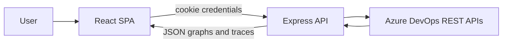

# Aclara Access Visualizer

Full-stack TypeScript application that visualizes Azure DevOps identity, group membership, and Git repository permissions as an interactive graph. It helps teams answer who has access, why a user has access to a repo, and where elevated or risky permission patterns appear.

**Why it exists**

- **Project-scoped analysis** — You always choose an Azure DevOps project at runtime; nothing is hardcoded to a single project.
- **Access tracing** — Explain effective Git access between a selected user and repository with a step-by-step path.
- **Risk signals** — Surfaces over-privileged identities where sensitive permission bits apply (as modeled in the graph and UI).
- **Shareable state** — Workspace selections sync to the URL (`project`, `user`, `repo`, `view`) for refresh and deep links.

---

## Features

### Connection

- Connect with **organization name** and **personal access token (PAT)** from the UI; credentials are stored server-side behind an **HttpOnly session cookie**.
- Optional **server-wide** Azure DevOps org + PAT via environment variables (see [Configuration](#configuration)); useful for demos or single-tenant deployments.
- **Disconnect** clears the session from the server.

### Workspace

- **Project picker** with search, keyboard navigation, and recent projects (session memory).
- **Project overview** — Snapshot counts, risk summary, and task-oriented entry points into investigation.
- **Investigation** — Graph canvas, explorers, trace panel, and inspector.

### Graph

- Interactive **node–edge** diagram (users, groups, repositories, permission edges).
- **View modes** — Summary (permission-focused), path (selection/trace slice), advanced (includes membership edges).
- **Text filter** — Highlight, contextual (+ neighbors), or hide non-matching nodes; optional “over-privileged only” filter.

### Analysis

- **Access trace** panel for user ↔ repository effective access; timeline syncs with graph emphasis.
- **Node inspector** for contextual metadata (e.g. groups).
- Visual emphasis for **selected** and **elevated** nodes where applicable.

### Deep linking

- Query parameters stay in sync with **project**, **user**, **repo**, and **workspace view** (`overview` | `investigate`).

---

## How it works

1. The browser loads the SPA and checks session status against the backend API.
2. If there is no valid session (and no optional env-based server credentials), the app routes to **Connect**; the user submits org + PAT, and the API creates a session.
3. The user selects an **Azure DevOps project**; all graph, user, repo, and trace calls are scoped to that project.
4. The backend uses the **Azure DevOps REST APIs** with the active credential (session or env fallback) and returns **normalized** JSON (graphs, traces, lists)—not raw AzDO payloads to the client.
5. The frontend renders **overview** or **investigation**: React Query fetches data; Zustand holds workspace UI state; React Flow displays the graph with Dagre layout.



---

## Architecture

**Monorepo** — Bun workspaces: `apps/backend`, `apps/frontend` (see root `package.json`).

### Backend (`apps/backend`)

- **Express** HTTP API, **Zod**-validated configuration (`src/config/env.ts`).
- **CORS** with `credentials: true` so the SPA can send session cookies; `CORS_ORIGIN` must match the browser origin in production.
- **Authentication resolution** (`src/middleware/aclaraAuth.middleware.ts`): valid session cookie first; if absent, optional `AZURE_DEVOPS_ORG` + `AZURE_DEVOPS_PAT` from the environment.
- Azure DevOps access is centralized in the backend client layer (not ad-hoc HTTP from the browser).

### Frontend (`apps/frontend`)

- **React 18**, **Vite**, **TypeScript**, **Tailwind CSS**.
- **React Router** — `/connect` (credentials), `/workspace` (gated on session).
- **TanStack Query** for server state; **Zustand** for visualizer/workspace state.
- **@xyflow/react** (React Flow) + **@dagrejs/dagre** for graph layout.

**Data flow:** Browser → same or cross-origin API (with cookies if cross-origin) → Azure DevOps → normalized responses → SPA.

---

## Getting started

### Prerequisites

- [Bun](https://bun.sh/) installed  
- **Note:** `@types/dagre` is pinned to `^0.7.54` because a newer major is not published on the registry; it types `@dagrejs/dagre`.

### Install

```bash
bun install
```

### Environment files

- Copy `apps/backend/.env.example` to `apps/backend/.env`.
- Copy `apps/frontend/.env.example` to `apps/frontend/.env` (optional: `VITE_APP_TITLE`, `VITE_LOG_LEVEL`).

### Run locally

**Option A — two terminals**

```bash
# Terminal 1 — API (default http://localhost:3001)
cd apps/backend && bun run dev

# Terminal 2 — SPA (default http://localhost:5173; Vite proxies /api → :3001)
cd apps/frontend && bun run dev
```

**Option B — root**

```bash
bun run dev
```

Runs all workspace `dev` scripts.

Open the Vite URL (e.g. `http://localhost:5173`). If you are not connected, you are sent to **Connect**. With optional env org+PAT set on the server, the session endpoint may report connected without using the Connect form.

**Health check:** `GET http://localhost:3001/api/health`

### Root scripts

| Script | Description |
| ------ | ----------- |
| `bun run dev` | Run all workspace `dev` scripts |
| `bun run build` | Build all packages |
| `bun run typecheck` | Typecheck all packages |
| `bun run test` | Run tests in workspaces that define `test` |

---

## Usage

1. **Connect** — Enter your Azure DevOps organization (subdomain or URL form as prompted by the UI) and a PAT with appropriate scope for projects, identities, and Git security.
2. **Choose a project** — Use the entry screen or header picker (search, recents).
3. **Overview** — Review counts, risk summary, and shortcuts into investigation modes.
4. **Investigate** — Explore the graph; use sidebar lists for users, repos, and risks; switch graph view modes and filters.
5. **Trace** — Select a user and a repository (from the graph or lists) to see why access is granted or denied; use trace steps to emphasize path on the graph.
6. **Inspector** — Open details for supported node types (e.g. groups) from the graph.

**URL state** — With a project selected, the app keeps `project`, `user`, `repo`, and `view` in the query string so links are restorable. Example: `/workspace?project=MyProject&view=overview`.

The SPA uses `fetch` with `credentials: "include"` so the session cookie is sent on API requests.

---

## Configuration

### Backend (`apps/backend/.env`)

| Variable | Purpose |
| -------- | ------- |
| `AZURE_DEVOPS_ORG` | Optional. If set **with** `AZURE_DEVOPS_PAT`, the API can run without a user session. |
| `AZURE_DEVOPS_PAT` | Optional. Server-side PAT; use only when intentional (e.g. single-tenant). |
| `PORT` | API port (default `3001`). |
| `NODE_ENV` | `development` \| `production` \| `test`. |
| `CORS_ORIGIN` | Browser origin allowed for credentialed CORS (default `http://localhost:5173`). **In production, set this to your deployed SPA origin exactly** (scheme + host + port). |
| `SESSION_COOKIE_NAME` | Session cookie name (default `aclara_sid`). |
| `SESSION_MAX_AGE_SECONDS` | Session lifetime (default `86400`). |
| `CACHE_TTL_*` | In-memory cache TTLs for AzDO-backed data (seconds). |
| `LOG_LEVEL` / `LOG_FORMAT` | Logging; defaults favor `DEBUG` + pretty in development, `INFO` + `json` in production. |

**Credential precedence:** A valid **session cookie** always wins. If there is no session, the server may use **env** org+PAT when both are set. For typical multi-user production, omit env org/PAT and rely on per-user Connect sessions.

### Frontend (`apps/frontend/.env`)

The client calls the API with **relative URLs** (`/api/...`). In development, Vite proxies `/api` to the backend (`vite.config.ts`).

| Variable | Purpose |
| -------- | ------- |
| `VITE_APP_TITLE` | Optional window title branding. |
| `VITE_LOG_LEVEL` | Optional client log verbosity. |

`VITE_API_BASE_URL` appears in `.env.example` for reference; the current codebase does not read it—use a **reverse proxy** (or same host) so `/api` reaches the Express app in production, or add a small client wrapper if you need a separate API host.

### Production checklist (short)

- Set `NODE_ENV=production` and correct **`CORS_ORIGIN`** to your deployed SPA origin when the API and SPA are on **different** origins.
- If SPA and API share one origin (recommended), route `/api` to the backend; CORS is less of an issue for same-origin requests.
- Prefer **session-based** PATs per user; avoid shared env PATs unless that is an explicit product decision.

---

## Tech stack

| Layer | Technologies |
| ----- | -------------- |
| Runtime / package manager | Bun |
| Backend | Node.js, Express, TypeScript, Zod, Axios, dotenv, cors, helmet |
| Frontend | React 18, TypeScript, Vite, Tailwind CSS, React Router, TanStack Query, Zustand, Zod |
| Graph UI | @xyflow/react (React Flow), @dagrejs/dagre |

---

## License

Add a `LICENSE` file or replace this section with your chosen terms before public distribution.
